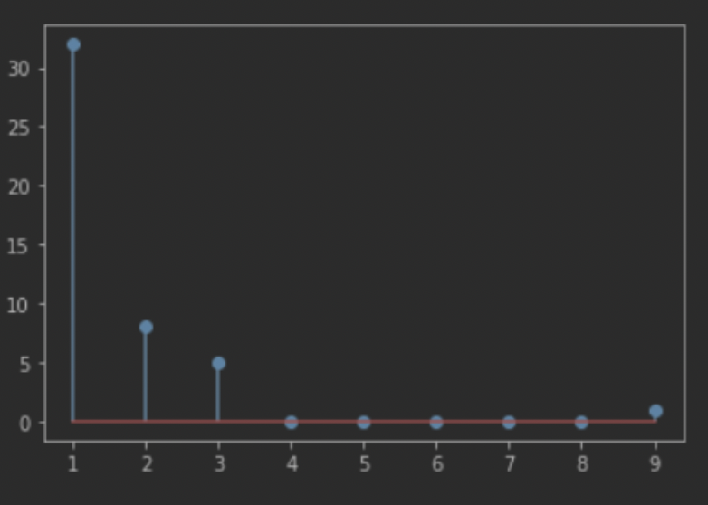
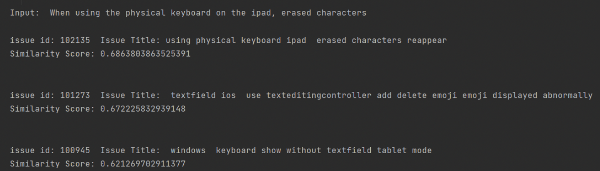

# Duplicate Issue Tracker
## CS 48000 Project

- Ahmet Berk TAŞ
- Doğkan Saraç
- Mert Ture
- Mizbah Çelik


## Summary
Duplicate Issue Tracker project is simply detecting if an entered issue has a duplicate issue in a semantic way. It calculates the similarity and returns the most similar ones. For the project, Flutter repository and issues are used.

All the data from the Flutter Repository are collected via [Github Api](https://docs.github.com/en)
The collected data without any cleaning is [here](issues.json).

## How to install and run the project

Cloning the repository
```
git clone https://github.com/cs48000-team3/DuplicateIssueTracker.git
```

### Running in the Google Colab

Just copy the cloned project to Google Colab and run the cells.

### Running in the local
Installing the requirements

```
pip install -r requirements.txt
```

Finally, in your IDE you can run the cells of the .ipynb files.


## Data Explanation

In the [first collected data](issues.json), so many unnecessary fields were getting collected. Therefore, it is cleaned into [here](issues_clean.json).

Each issue has its own `url, id, title, user, body, comments`. 

Total 69500 issue are collected but only 380 duplicate issue are used for testing.

After that, we needed each issue's duplicate. Hence, each issue's duplicate is collected from its comments because if an issues has its duplicate, it is tagged in the comments. Finally, each issues which has duplicate is gathered [here](issues_final.json).

Example data is below:
```
{
    "id": 102037,
    "title": "Flutter MDI window with multi Child Window Screen",
    "body": "may i create MDI window with multi child screens. this help to work on multi screens at the same time\r\n\r\n\r\n\r\n<!-- Thank you for using Flutter!\r\n\r\n     If you are looking for support, please check out our documentation\r\n
    "comments": [
        "Currently, Flutter apps acts like a tablet app, support for multiple windows (even the usual SDI) is due: https://github.com/flutter/flutter/issues/30701\r\n",
        "Closing as duplicate of #30701\r\n\r\nThank you"
    ],
    "originalId": 30701,
    "originalTitle": "Support multiple windows for desktop shells",
    "originalBody": "See discussion in https://github.com/google/flutter-desktop-embedding/issues/98\r\n\r\nIf we end up supporting multiple root views within one engine instance, this will require embedding API changes. If we don't, we'll need to have a viable strategy to recommend for coordinating between windows that works for cases that require constant synchronization (e.g., a tools palette in one window, with the canvas using those tools in another)"
}
```

## Models and Results

4 different models are used.

| Model  | Result |
| ------------- | ------------- |
| [TF-IDF](TFIDF_model.ipynb)  | Bad  |
| [Word2Vec](word2vec_model.ipynb)  | Bad  |
| [BERT](BERT_model_1.ipynb) | Neutral |
| [Roberta Large](testing_semantic_sim_with_transformers.ipynb) | Good |

Best performed model is Roberta Large because it checks the semantics of the sentences well.



- First duplicate: 32 out of 100
- Second most similar duplicate: 8 out of 100
- Third most similar duplicate: 5 out of 100

## Demo

Since best working model is `Roberta`, demo is done with it.

Input to model is:
```
{
    "id": 102135,
    "title": "When using the physical keyboard on the ipad, erased characters reappear",
    "body": "## Steps to Reproduce\r\n\r\n1. Execute `flutter run` on the code sample\r\n2. Input \u3042\u3044\u3046 ( in keyboard press aiu )\r\n3. preess delete key 3time\r\n4. input \u3048\u304a ( in keyboard press eo )\r\n\r\n**Expected results:**\r\nonly \u3048\u304a (2 words) is display\r\n\r\n",
    "comments": [
        "Hi @hatano0x06, Thanks for filing the issue. \r\n\r\nThere is a similar issue describing this case https://github.com/flutter/flutter/issues/99652, Please follow up there for further updates, Closing this issue as a duplicate. If you disagree feel free to write in the comments and we will reopen it.\r\n\r\nThank you."
    ],
    "originalId": 99652,
    "originalTitle": "TextField text reappears after calling `TextEditingController.clear` with Japanese text input",
    "originalBody": "<!-- Thank you for using Flutter!\r\n\r\n     If you are looking for support, please check out our documentation\r\n     or consider asking a question on Stack Overflow:\r\n* https://flutter.dev/\r\n* https://api.flutter.dev/\r\n*https://stackoverflow.com/questions/tagged/flutter?sort=frequent\r\n\r\n"
}
```
For this input, our demo output is below:




